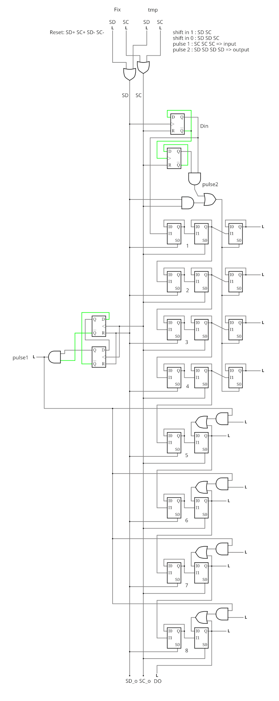
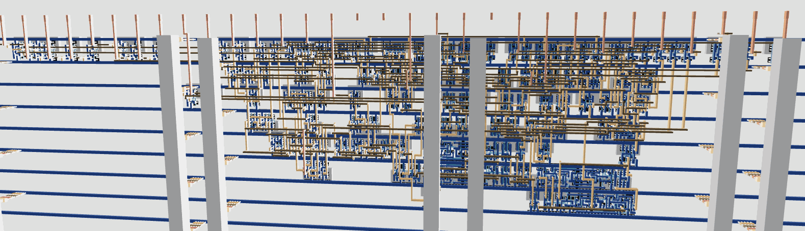

## How it works

As the name "Universal Latch-based Shift Register" implies, it's a shift register based on individual latches. The first advantage of this asynchronous method is the need of only two input signals.

- Instead of running on a single high-fanout clock pulse, there are two independent clock signals SD and SC with relaxed timing and fewer buffers.
- Instead of using one DFF per bit, it is split into its Master and Slave latches

All the operations, like shifting one bit, require non-overlapping, alternating pulses on SD and SC. This takes care of any transient condition and glitches. Capture and Update require slightly more complicated sequences but still use only SD and SC. The only exception is RESET, which is performed with an overlapping sequence.

## How fast does it run ?

I have no idea, it's all asynchronous magic. Short chains should reach 10 or 20MHz easily but since it's meant to be driven from some Arduino-style MCU through USB or a serial port, raw speed is not critical. The focus is on minimising any impact on the target circuit (surface, routing, power,...).

## Architecture

Below is an abridged diagram showing only 4 in and 4 out pins. Source : [DTAP2-ULSR on Hackaday.io](https://hackaday.io/project/206055-dtap2-ulsr) where transparent latches are replaced by back-fed MUX2 for simulation sake. There are 3 main stages :

- data input generator (recreates the missing data in pin's value)
- output block (somewhat merged with the previous block)
- input block (with its own counter)

The actual implementation has 12 bits of depth, with the 4 middle ones being both inputs and outputs.



## Structure

The input, output and inout stages are made from 2 or 3 latches, made from standard A21OI and A221OI cells. They are smaller than a DFF.


## Cell usage

For 8 inputs and 8 outputs (including 4 combined in and out)
* ``` a22oi a221oi a21oi :	66 ``` (including one for the full adder, the rest for the bulk of the scan chain)
* ``` buf : 35 ``` (I never asked for them)
* ``` inv : 4 ``` (including one for the full adder)
* ``` dfrbp : 4 ``` (for the decoders/counters)
* ``` xor2 : 2 ``` (Full adder)
* ``` and2 : 1 ``` capture decoder.

Result:


Conclusion :
``` 112 total cells (excluding fill and tap cells)```
And it's still bloated by the toolchain with
* many unwanted buffers (added at the interface),
* some "constant" cells (tiehi, tielow) for the io dir port and unused outputs,
* some gates for the extra full adder...

But can you do something this compact with the JTAG standard? And since each bit/stage does not require absolute synchronism or a tight timing, the clock network is relaxed and each register uses less space than a standard DFF.

## Protocol

You can find these operations in the ```test/test.py``` script.
* RESET is : set SD high, set SC high, set SD low, set SC low.
* inject a '0' bit in the chain : pulse SD, pulse SD, pulse SC.
* inject a '0' bit in the chain : pulse SD, pulse SC.
* Capture : RESET then pulse SC 4 times
* Update : pulse SD 4 times

A more elaborate protocol can be designed on top of this, for example: addressing specific registers by counting the number of bits injected. Let your imagination go wild!

## How to test

Use some Arduino for example, and play with the SD/SC signals. About 1us between each bit toggle is a good ballpark. An Arduino sketch will be provided someday, transcribing the code in ```test/test.py```

5 leftover pins are connected to a Full Adder that you can test it with the scan chain through external wires. Have fun injecting errors to see if the scan chain can detect them!
